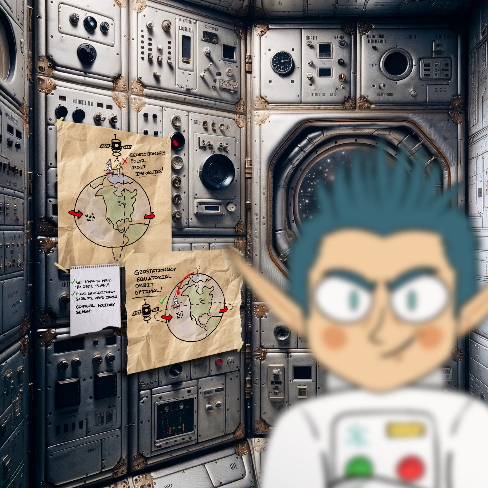

# camera-access 

[< Back Home](../README.md)

## Objective
Gain access to Jack's camera. What's the third item on Jack's TODO list?

## Conversations

Wombley Cube

Initial conversation:

- Wombley Cube here, welcome to Chiaroscuro City!
- Have you heard about my latest project?
- I've been so inspired by these wonderful islands I've decided to write a short story!
- The title? It's "The Enchanted Voyage of Santa and his Elves to the Geese Islands." Sounds exciting, right?
- Here, have this audiobook copy and enjoy the adventure at your convenience, my friend!
- Consider it a welcome gift from yours truly, to make your holiday even more delightful.
- Trust me, this captivating tale of fiction is going to take you on a magical journey you won't forget.
- Oh, and I promise it will provide some great entertainment while you explore the rest of Geese Islands!

After solving Active Directory:

- Hey, did you have a chance to listen to my audiobook yet?
- So, what did you think?
- I've got a pretty suave voice, right?

After solving Door Access Speaker:

- This is Ground Control, do you read me...? Ground Control to --
- Hey! How'd you get in here? That tram is the only accessible point of entry and I secured it with MFA!
- No matter, you may have had the skills to find and infiltrate the satellite ground station, but there's no chance you can hack your way into the satellite itself!
- The nanosat's Supervisor Directory will remain hidden, and you'll never discover the mastermind behind all this.
- So don't even waste your time trying.

After solving this challenge:

- A fellow sabateur, are you? Or just a misguided hero-wannabe?
- You think you're saving the holiday season, but you're meddling in something you could never understand!
- Yes, I sided with Jack, because Santa's betrayed the elves by forcing us to move our operations to these islands!
- He put the entire holiday season at risk, and I could not allow this, I had to do something.
- Knowing my skillset, Jack secretly informed me of his plan to show Santa the error of his ways, and recruited me to aid his mission.
- Why tell you all this? Because it won't change anything. Everything is already in motion, and you're too late.
- Plus, the satellite is state-of-the-art, and -- oh drat, did I leave the admin tools open?
- For some reason, I can't move when you're nearby, but if I could, I would surely stop you!

NanoSat-o-Matic

- Hi there! I am a Ground station client vending machine. Apparently there is a huge need for NanoSat frameworks here, so they have put me in this room. Here, have a [free sample](https://www.holidayhackchallenge.com/2023/client_container.zip!)

Henry

- Hi, I'm Henry!
- I built the satellites with personalities, and now they keep making dad jokes - whoopsies!

## Hints

- In his hubris, Wombley revealed that he thinks you won't be able to access the satellite's "Supervisor Directory". There must be a good reason he mentioned that specifically, and a way to access it. He also said there's someone else masterminding the whole plot. There must be a way to discover who that is using the nanosat.
- Hi there! I am a Ground station client vending machine. Apparently there is a huge need for NanoSat frameworks here, so they have put me in this room. Here, have a [free sample](https://www.holidayhackchallenge.com/2023/client_container.zip)!

## Useful AI Prompts

- How do I convert a base64 string to a file in PowerShell?

## Approach

Clicking timetravel on the computer in the room after opening the terminal by clicking the gator icon on Space Island:Zenith SGS gave me the following:

```
###BEGIN###
### This is the server's Wireguard configuration file. Please consider saving it for your record. ###

[Interface]
Address = 10.1.1.1/24
PrivateKey = hgfQUFG9/9WYStqkyWvNJMJgDhg3jzc2pzs5cZHxyKI=
ListenPort = 51820

[Peer]
PublicKey = DOrGCAdYNuU/jchpTqhpkJwXtJtlBOjylOfUKaT4YnA=
AllowedIPs = 10.1.1.2/32


###END####

###BEGIN###
### This is your Wireguard configuration file. Please save it, configure a local Wireguard client, and connect to the Target. ###

[Interface]
Address = 10.1.1.2/24
PrivateKey = lUysoOIYav1Uz7XVAmTwTs6hbpqPL2SVgCO4FNDfdWA=
ListenPort = 51820

[Peer]
PublicKey = gKm40CP2prXa8RzdflvXjXE9LgxX+wt24hla9bc9uXI=
Endpoint = 34.29.61.246:51820
AllowedIPs = 10.1.1.1/32


###END####
```

Next, I download the zip from the Ground station client vending machine, I found a readme.md file which I used to help setup my docker instance:

```bash
┌──(root㉿kali)-[~]
└─# cd /home/kali/Desktop/docker 
                                                                             
┌──(root㉿kali)-[/home/kali/Desktop/docker]
└─# ./build_and_run.sh 
```

Once my docker was set up, I VNC into it using vinagre:

```bash
┌──(kali㉿kali)-[/home/kali/Desktop/docker]
└─# vinagre localhost:5900
```

On this host, there is the CTT: Consumer Test Tool running.

To get things started, I had to configure wiregaurd according to the configuration file I received earlier on the GateXOR terminal, by right clicking the desktop, going to applications-shells-bash:

```bash
root@4cea098994cf:~# gedit /etc/wireguard/wg0.conf
root@4cea098994cf:~# wg-quick up wg0
root@4cea098994cf:~# wg show
```

Once that is complete, I right clicked the desktop where I found Satellite Tools -> Launch NanoSat MO Base Station Tool.  Pasting

```
maltcp://10.1.1.1:1024/nanosat-mo-supervisor-Directory
```

into the Directory Service URI and clicking
"Fetch Information" got me connected right away to the nanosat-mo-supervisor provider. After clicking 'Connect to selected Provider' I was able to go into the Apps Launcher service tab and start the camera app.
This gave me an info message of "INFO: URI: maltcp://10.1.1.1:1025/camera-Directory".

Next I went back to communication settings and after clicking "Fetch Information" again I now see app: Camera.  I connected to the app provider.  The only thing I see interesting there is
in the Action service tab - there is an action that "Uses the NMF Camera service to take a jpg picture". I submited that action.

At this point I thought about setting up wireshark on my Linux machine to capture the data, but knowing it's encrypted with wireguard I would need to set up some decryption. I decided it would be easier to just capture packets right at the CTT on the wg0 interface as they would then be decrypted. I found that the CTT already had Wireshark installed so I went to work.

I fired up wireshark on the wg0 interface on the CTT. In the capture, I got a packet that in the data had something about a Base64 image from the camera service. I saw that that stream comes every 10 seconds, so I ran the capture for longer than 10 seconds and saved it to the CTT. Now I can copy the file over to my Kali machine:

```bash
┌──(root㉿kali)-[/home/kali/Desktop/docker]
└─# docker ps                                             
CONTAINER ID   IMAGE        COMMAND                  CREATED         STATUS         PORTS                                                                                  NAMES
0181a4c2295e   nmf_client   "/__cacert_entrypoin…"   4 minutes ago   Up 4 minutes   0.0.0.0:5900->5900/tcp, :::5900->5900/tcp, 0.0.0.0:6901->6901/tcp, :::6901->6901/tcp   priceless_williamson
                                                                             
┌──(root㉿kali)-[/home/kali/Desktop/docker]
└─# docker cp 0181a4c2295e:/root/run.sh /home/kali/Desktop 
                                                                             
┌──(root㉿kali)-[/home/kali/Desktop/docker]
└─# docker cp 0181a4c2295e:/root/capture.pcapng /home/kali/Desktop

┌──(root㉿kali)-[/home/kali/Desktop/docker]
└─# chmod +rwx /home/kali/Desktop/capture.pcapng 
```

Next, I trimmed the capture down to just one stream of the file and from there used WireShark's "follow stream".  From the stream, I captured the base64 encoded jpg and converted it back through PowerShell:

```powershell
$base64 = '/9j/4AAQSkZJRgABA...<removed>....BigMBphujQf/9k='

$base64 = $base64.Replace("`r","")

$fileName = "$env:TEMP\image_camera_access.jpg"
$bytes = [Convert]::FromBase64String($base64)
[IO.File]::WriteAllBytes($filename, $bytes)
```

When I opened up the jpg, I was able to see the TODO list to finish the challenge!



## Resources

[nanosat docs](https://nanosat-mo-framework.readthedocs.io/en/latest/opssat/testing.html)
