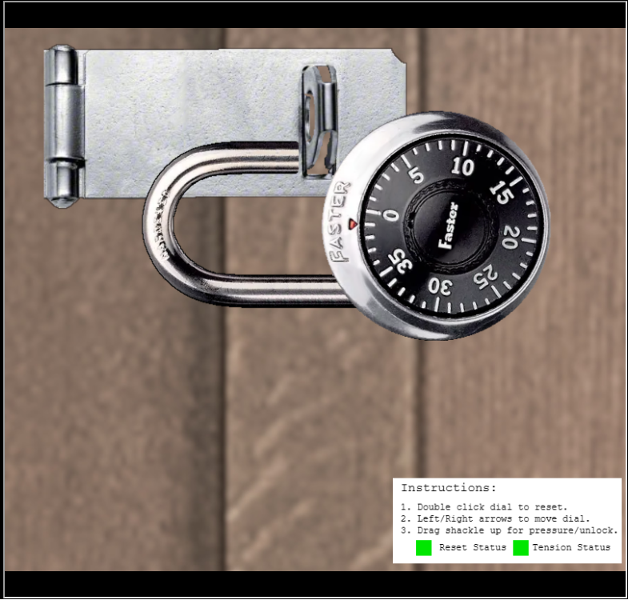

<!-- report-keep -->

# faster-lock-combination 

<!-- report-ignore -->

[< Back Home](../README.md)

<!-- report-keep -->

## Objective

Over on Steampunk Island, Bow Ninecandle is having trouble opening a padlock. Do some research and see if you can help open it!

<!-- report-ignore -->

## Conversations

Bow Ninecandle

Initial conversation:

- Hey there! I'm Bow Ninecandle, and I've got a bit of a... 'pressing' situation.
- You see, I need to get into the lavatory, but here's the twist: it's secured with a combination padlock.
- Talk about bad timing, right? I could really use your help to figure this out before things get... well, urgent.
- I'm sure there are some clever tricks and tips floating around [the web](https://www.youtube.com/watch?v=27rE5ZvWLU0) that can help us crack this code without too much of a flush... I mean fuss.
- Remember, we're aiming for quick and easy solutions here - nothing too complex.
- Once we've gathered a few possible combinations, let's team up and try them out.
- I'm crossing my legs - I mean fingers - hoping we can unlock this door soon.
- After all, everyone knows that the key to holiday happiness is an accessible lavatory!
- Let's dive into this challenge and hopefully, we won't have to 'hold it' for too long! Ready to help me out?

## Approach

Spend a long time putting the correct pressure on a virtual Faster lock to open it, or mess with the javascript :)


## Alternate approach

As an alternate approach, there are several ways you can interact with the javascript.  One simple approach is to simply right click on the lock, click inspect, and in the console type lock_numbers to get the output:

```json
{
    "first_number": 19,
    "second_number": 37,
    "third_number": 39,
    "bad_third_number": 19,
    "first_number_sticky": 14,
    "guess_number1": 9,
    "guess_number2": 4
}
```

Entering the combination 19-37-39:



<!-- report-ignore -->


