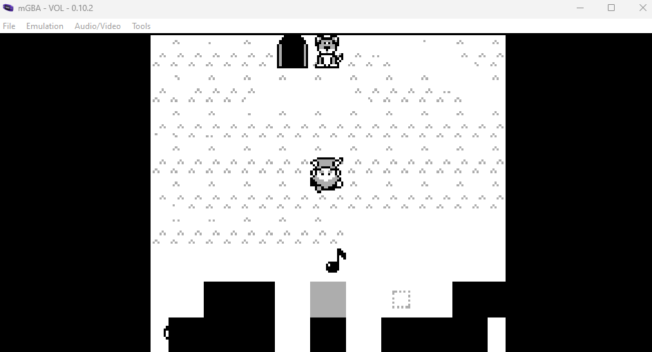
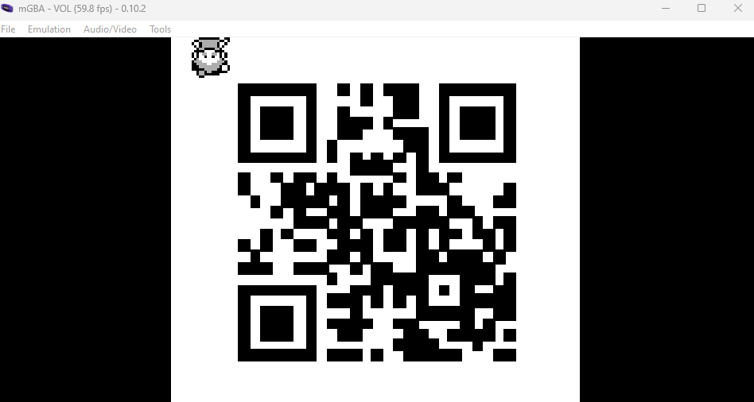

<!-- report-keep -->

# game-cartridges-vol1 

<!-- report-ignore -->

[< Back Home](../README.md)

<!-- report-keep -->

## Objective

Find the first Gamegosling cartridge and beat the game

<!-- report-ignore -->

## Conversations

Dusty Giftwrap

Initial conversation:

- Arrr, matey, shiver me timbers! There be buried treasure herrrrre.
- Just kidding, I'm not really a pirate, I was just hoping it would make finding the treasure easier.
- I guess you heard about the fabled buried treasure, too? I didn't expect to see anyone else here. This uncharted islet was hard to find.
- I bet one of these creepy toys has the treasure, and I'm sure not going anywhere near them!
- If you find the treasure, come back and show me, and I'll tell you what I was able to research about it.
- Good luck!

After finding game cartridge:

- Whoa, you found it!
- It's a... video game cartridge? Coooooollll... I mean, arrrrrr....
- So, here's what my research uncovered. Not sure what it all means, maybe you can make sense of it.

After finding all three game cartridges:

- You have all three? I think that makes you ruler of the pirates!

## Hints

- There are 3 buried treasures in total, each in its own uncharted area around Geese Islands. Use the gameboy cartridge detector and listen for the sound it makes when treasure is nearby, which gets louder the closer you are. Also look for some kind of distinguishing mark or feature, which could mark the treasure's location.
- Listen for the gameboy cartridge detector's proximity sound that activates when near buried treasure. It may be worth checking around the strange toys in the Tarnished Trove.
- Giving things a little push never hurts.
- Out of sight but not out of ear-shot.
- You think you fixed the QR code? Did you scan it and see where it leads?

<!-- report-keep -->

## Approach

Once I found the game, a web link to it is added to my items. By going to the web link, I can actually capture the rom file.

I played the game by using the B key to fire musical notes into the blocks in the QR Code. When you do this to a block that is movable, it will play a song for a short period while highlighting where the block is supposed to be.

I had to be careful pushing the blocks into place so I didn't get stuck in a position where I couldn't move another block into it's location, but in the end I was presented a QR Code that when scanned, gave me the message to solve the challenge.

The biggest challenge is solving the last block which had to be moved outside the QR code to the West and down around the south all the way east to it's position in the mid-east section.

After the last of the 7 blocks is in it's proper place, I was presented a QR code to scan and get the flag to solve the challenge:

[https://8bitelf.com](https://8bitelf.com)

flag:santaconfusedgivingplanetsqrcode
