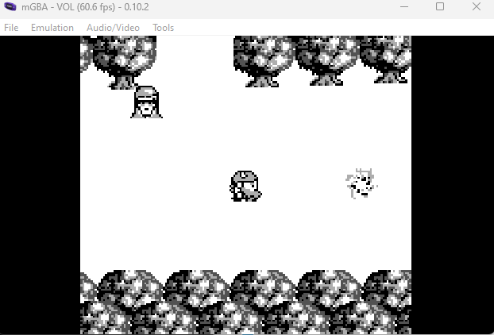
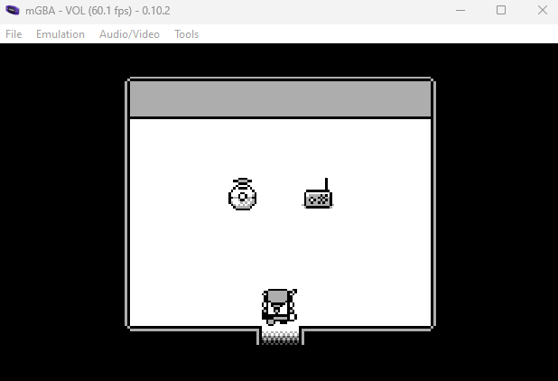

# game-cartridges-vol2 

[< Back Home](../README.md)

## Objective

Find the second Gamegosling cartridge and beat the game

## Conversations

Tinsel Upatree

Initial conversation:

- I can't believe I was actually able to find this underground cavern!
- I discovered what looked liike an old pirate map in the attic of one of those huts in Rainraster Cliffs, and it actually led somewhere!
- But now that I've seen where it leads, I think this might've been a bad idea. This place is scary! Maybe you want to take it from here?
- There are 3 buried treasures in total, each in its own uncharted area around Geese Islands.
- I've been searching for a bit, but the mustiness down here is making me sneeze!
- Maybe you'll be able to find it. Here, use my Gameboy Cartridge Detector. Go into your items and test it to make sure it's still working.
- When you get close to the treasure, it'll start sounding off. The closer you get, the louder the sound.
- No need to activate or fiddle with it. It just works!
- I bet it's somewhere right... near... ACHOOO!
- If you find the treasure, come back and show me, and I'll tell you what I was able to research about it.
- Good luck!

After finding game cartridge:

- Whoa, you found it!
- What version is it?
- Did you know that many games had multiple versions released? Word is: volume 2 has 2 versions!

After finding all three game cartridges:

- You have all three? What a glorious collection!

## Hints

- Try poking around Pixel Island. There really aren't many places you can go here, so try stepping everywhere and see what you get!
- This feels the same, but different!
- If it feels like you are going crazy, you probably are! Or maybe, just maybe, you've not yet figured out where the hidden ROM is hiding.
- I think I may need to get a DIFFerent perspective.
- I wonder if someone can give me a few pointers to swap.

## Useful AI Prompts

- how do I compare two binary files in Windows?

## Approach

Looking at the conversations, it appears there is more than one version of this game. By refreshing the play on this multiple times, I was able to capture two .gb files: game0.gb and game1.gb.

Once I successfully acquired both roms using developer tools -> network, I used Windows FC command to compare the two:

```console
C:\>fc /B %USERPROFILE%\Documents\HolidayHackChallenge\vol2_game0_original.gb %USERPROFILE%\Documents\HolidayHackChallenge\vol2_game1_original.gb
Comparing files %USERPROFILE%\DOCUMENTS\HOLIDAYHACKCHALLENGE\vol2_game0_original.gb and %USERPROFILE%\DOCUMENTS\HOLIDAYHACKCHALLENGE\VOL2_GAME1_ORIGINAL.GB
0000014F: B3 86
00000593: 0B D2
00000594: 4B AC
00000595: 9A 3D
00000596: 23 2D
00016A84: 03 0B
00016AB8: 09 06
00017C80: 02 01
0001850E: 02 03
0001850F: 80 00
00018513: 0B 04
00018514: 80 00
```

I downloaded a couple of different emulators to play the games locally, and both games were similar but didn't have a way of getting anywhere in the game. So, I took an approach of modifying one of the games by trial and error just changing the differing values between both versions and then playing the modified game until I noticed something different in the game.

After making the following changes to game1.gb, I came upon a new item in the main room:

```
Location old new
00016AB8: 06 09
00017C80: 01 02
0001850E: 03 02
0001850F: 00 80
00018513: 04 0B
00018514: 00 80
```



Once I hit the A button on the new item, I entered a room with a few more items:



When I went to the radio in the room and hit the A button on it, there was audio with what appeared to be morse code tones:

```
--. .-.. ----- .-. -.--
```

I had to listen to it a couple of times, but after noting down the tones and running them through an [Online Decoder](https://morsedecoder.com/), I got the message:

```
GL0RY
```

That's our answer - enter GL0RY into the challenge!

## Alternate approach

## Resources

[mGBA](https://mgba.io/)

[Morse Decoder](https://morsedecoder.com/)
