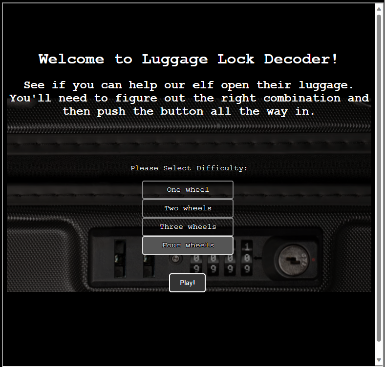
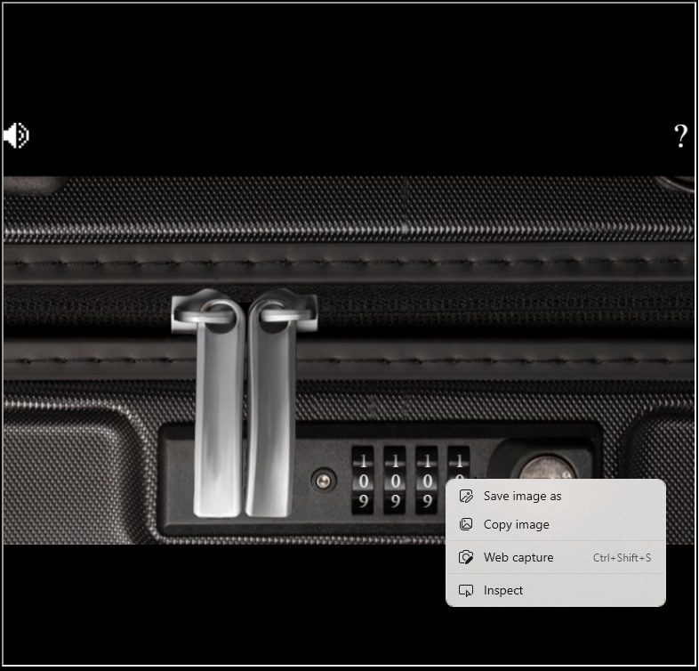
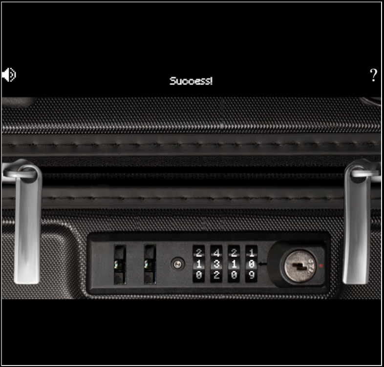
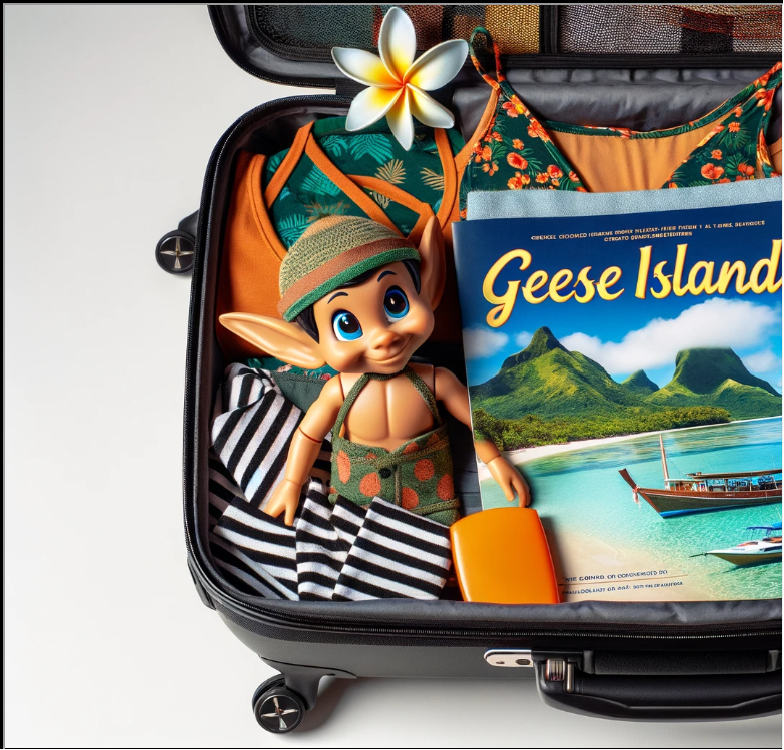

# luggage-lock 

[< Back Home](../README.md)

## Objective

Help Garland Candlesticks on the Island of Misfit Toys get back into his luggage by finding the correct position for all four dials

## Conversations

Garland Candlesticks

Initial conversation:

- Hey there, I'm Garland Candlesticks! I could really use your help with something.
- You see, I have this important pamphlet in my luggage, but I just can't remember the combination to open it!
- Chris Elgee gave a talk recently that might help me with this problem. Did you attend that?
- I seem to recall Chris mentioning a technique to figure out the combinations...
- I have faith in you! We'll get that luggage open in no time.
- This pamphlet is crucial for me, so I can't thank you enough for your assistance.
- Once we retrieve it, I promise to treat you to a frosty snack on me!

## Hints

- Check out Chris Elgee's [talk](https://youtu.be/ycM1hBSEyog) regarding his and his wife's luggage. Sounds weird but interesting!

## Useful AI Prompts

- How do I introduce a delay in a javascript loop?

## Approach

Simple approach - watch the talk above and put pressure on the latch and move the rollers until there is resistance.

## Alternate approach

As an alternate approach, I could use the websocket to emit messages until the lock opens, but for fun let's just play with the existing functions and watch the lock spin and open.

Simply start the game with four wheels:



Right click on the combination and click inspect:



In the developer tools, enter the following javascript into the console and sit back and relax!

```javascript
function loop() {
  setTimeout(function() {
    attemptOpen();
    if (win === false) {
      if (dials[0].value == 9) {
        if (dials[1].value == 9) {
          if (dials[2].value == 9) {
            incWheel(3);
          }
        incWheel(2);
        }
      incWheel(1);
      }
    incWheel(0);
    loop();
    }
  }, 10);
};

loop();
```





## Resources
