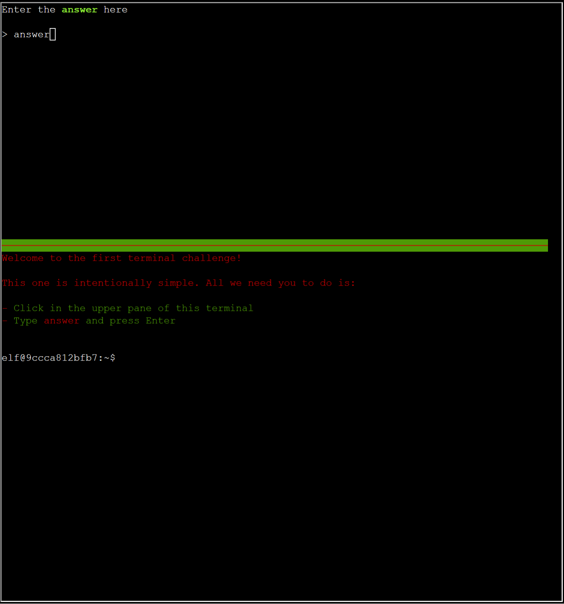

# orientation 

## Objective

Talk to Jingle Ringford on Christmas Island and get your bearings at Geese Islands.

## Conversations

Jingle Ringford

Initial conversation:

- Welcome to the Geese Islands and the 2023 SANS Holiday Hack Challenge!
- I'm Jingle Ringford, one of Santa's many elves.
- Santa asked me to meet you here and give you a short orientation to this festive event.
- Before you head back to your boat, I'll ask you to accomplish a few simple tasks.
- First things first, here's your badge! It's that starfish in the middle of your avatar.
- Great - now you're official!
- Click on the badge on your avatar. That's where you will see your Objectives, Hints, and Conversations for the Holiday Hack Challenge.
- We've also got handy links to some awesome talks and more there for you!
- Fantastic!
- OK, one last thing. Click on the Cranberry Pi Terminal and follow the on-screen instructions.

After solving challenge:

- Perfect! Your orientation is now complete!
- Head back to your boat or click on the anchor icon on the left of the screen to set sail for Frosty's Beach where Santa's waiting for you. I've updated your boat's compass to guide the way.
- As you sail to each island, talk to the goose of that island to receive a colorful lei festooning the masts on your ship.
- Safe travels my friend and remember, relax, enjoy the sun, and most importantly, have FUN!

## Hints

## Useful AI Prompts

## Approach

Straight forward - for the orientation, simply enter answer after clicking on the terminal:

```console
Welcome to the first terminal challenge!

This one is intentionally simple. All we need you to do is:

- Click in the upper pane of this terminal
- Type answer and press enter

elf@53d3586a6ela:~$
```




## Alternate approach

## Resources
